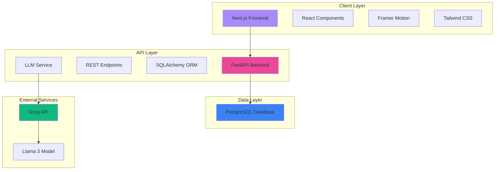
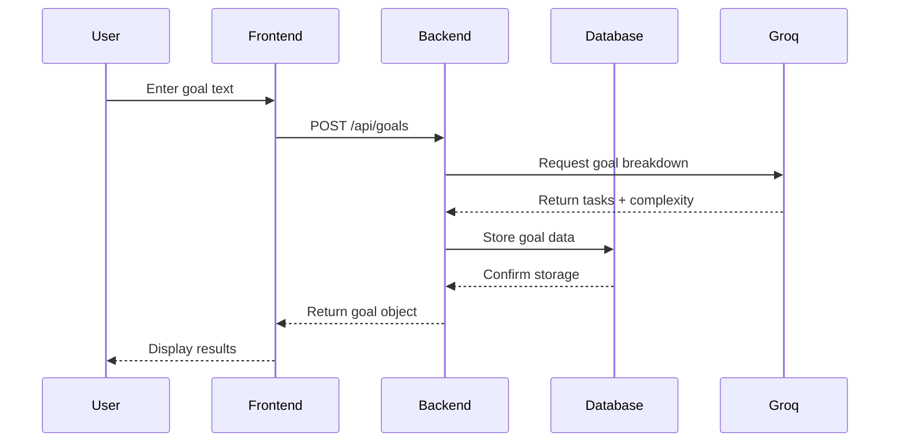

# System Architecture

## Overview

Smart Goal Breaker is a full-stack web application that uses AI to transform vague goals into actionable steps. The system follows a modern three-tier architecture with clear separation of concerns.

## Architecture Diagram



## Component Details

### Frontend (Next.js 14)

**Technology Stack:**
- Next.js 14 with App Router
- TypeScript for type safety
- Tailwind CSS for styling
- Framer Motion for animations
- shadcn/ui component library

**Key Features:**
- Server-side rendering (SSR)
- Client-side state management
- Responsive design
- Real-time toast notifications
- Animated UI transitions

**File Structure:**
```
frontend/
├── app/
│   ├── components/
│   │   ├── GoalForm.tsx      # Input form component
│   │   └── ResultCard.tsx    # Results display component
│   ├── globals.css            # Global styles and themes
│   ├── layout.tsx             # Root layout with metadata
│   └── page.tsx               # Main page component
├── components/ui/             # shadcn/ui components
└── lib/                       # Utility functions
```

### Backend (FastAPI)

**Technology Stack:**
- FastAPI for high-performance API
- SQLAlchemy for database ORM
- Pydantic for data validation
- Uvicorn ASGI server

**Key Features:**
- RESTful API design
- Automatic OpenAPI documentation
- Database connection pooling
- Error handling and validation
- CORS middleware for cross-origin requests

**File Structure:**
```
backend/app/
├── main.py          # FastAPI application and routes
├── models.py        # SQLAlchemy database models
├── schemas.py       # Pydantic schemas for validation
├── db.py            # Database configuration
├── llm.py           # LLM integration service
└── requirements.txt # Python dependencies
```

**API Endpoints:**
- `POST /api/goals` - Create a new goal
- `GET /api/goals` - List all goals (latest 50)
- `GET /api/goals/{id}` - Get specific goal by ID
- `GET /docs` - Swagger UI documentation

### Database (PostgreSQL)

**Schema:**

```sql
CREATE TABLE goals (
    id SERIAL PRIMARY KEY,
    text TEXT NOT NULL,
    tasks JSONB NOT NULL,
    complexity INTEGER NOT NULL,
    created_at TIMESTAMP DEFAULT CURRENT_TIMESTAMP
);
```

**Features:**
- JSONB for flexible task storage
- Indexed primary key for fast lookups
- Timestamp tracking for analytics

### AI Service (Groq)

**Integration:**
- Groq API for fast LLM inference
- Llama 3 8B model for goal breakdown
- Fallback to local stub when API unavailable

**Prompt Engineering:**
- Structured JSON output format
- Complexity rating (1-10 scale)
- Exactly 5 actionable steps per goal

## Data Flow

### Goal Creation Flow



## Deployment Architecture

### Development Environment
- Frontend: `localhost:3000` (Next.js dev server)
- Backend: `localhost:8000` (Uvicorn)
- Database: `localhost:5432` (PostgreSQL in Docker)

### Production Environment

**Frontend (Vercel):**
- Automatic deployments from Git
- Edge network CDN
- Environment variables for API URL

**Backend (Render/Railway):**
- Docker container deployment
- Managed PostgreSQL database
- Environment variables for secrets

**Database:**
- Managed PostgreSQL service
- Automatic backups
- Connection pooling

## Security Considerations

1. **API Keys:** Stored in environment variables, never committed
2. **CORS:** Configured for specific origins in production
3. **Input Validation:** Pydantic schemas validate all inputs
4. **SQL Injection:** SQLAlchemy ORM prevents injection attacks
5. **Rate Limiting:** Consider adding for production use

## Scalability

**Current Limitations:**
- Single backend instance
- No caching layer
- No load balancing

**Future Improvements:**
- Redis for caching frequent goals
- Horizontal scaling with load balancer
- CDN for static assets
- Database read replicas

## Monitoring & Observability

**Recommended Tools:**
- Frontend: Vercel Analytics
- Backend: Sentry for error tracking
- Database: PostgreSQL logs
- API: Custom logging middleware

## Technology Choices

| Requirement | Technology | Rationale |
|------------|------------|-----------|
| Frontend Framework | Next.js 14 | SSR, App Router, excellent DX |
| Backend Framework | FastAPI | High performance, auto docs, async |
| Database | PostgreSQL | Robust, JSONB support, scalable |
| AI Service | Groq | Fast inference, generous free tier |
| Styling | Tailwind CSS | Utility-first, rapid development |
| Animations | Framer Motion | Declarative, performant |
| Deployment | Vercel + Render | Easy setup, automatic deploys |

## Development Workflow

1. **Local Development:**
   ```bash
   # Terminal 1: Backend
   docker-compose up
   
   # Terminal 2: Frontend
   cd frontend && npm run dev
   ```

2. **Testing:**
   - Manual testing via UI
   - API testing via Swagger UI
   - Future: Add unit and integration tests

3. **Deployment:**
   - Push to GitHub
   - Automatic deployment via CI/CD
   - Environment variables configured per platform
